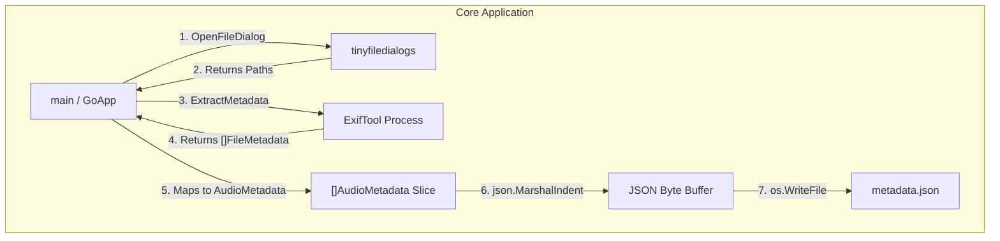

# Batch Audio Metadata Tool

This is a small utility that uses Exiftool to read the metadata of a batch of user-selected audio files and output to a JSON file. It lays the groundwork for more functionality on top, such as data validation and normalization.

## Data Flow


## Prerequisites

* **Go** (1.20+)
* **ExifTool** must be installed on your system PATH (`brew install exiftool` on macOS, or download via [exiftool.org](https://exiftool.org/)).
* **Cgo Requirements:** GCC/Clang compiler enabled (standard on macOS/Linux; required for `tinyfiledialogs` C-bindings).

## Quick Start

1. Clone the repository.
```bash
   git clone https://github.com/siekmang/audio-metadata.git
   cd audio-metadata
```

2.Build the binary.
```bash
  go build -o audio-metadata
```

3. Run the application.
```bash
  ./audio-metadata
```

*Note - On your first time running it, it will prompt you to select an output location. It saves that location so you don't have to set it every time.*

## Example Output

```json
[
  {
    "title": "Cockatiel",
    "artist": "Little Wild",
    "album": "Victories",
    "genre": "Rock",
    "duration": "0:03:13",
    "channels": 2,
    "sample_rate": 44100,
    "bit_rate": 256000,
    "track": 4,
    "total_tracks": 11,
    "file_type": "M4A"
  },
  {
    "title": "Love Away",
    "artist": "Little Wild",
    "album": "Victories",
    "genre": "Rock",
    "duration": "0:05:03",
    "channels": 2,
    "sample_rate": 44100,
    "bit_rate": 256000,
    "track": 5,
    "total_tracks": 11,
    "file_type": "M4A"
  },
]
```

## Next Steps

- [x] *Add Documentation* - There are a few functions and places where comments may be valuable
- [x] *Expand README*
- [x] *File Location* - Print where the file saved to
- [x] *Unique File Names* - Expand file name to have date/time
- [x] *Location Choice* - Give user choice of output file location
- [ ] *Data Validation* - Allow the user to set desired parameters to test against
- [ ] *Data Normalization* - Introduce the ability to correct parameters if they are incorrect
- [ ] *Type Choice* - Give user choice of output file type
- [ ] *Test Coverage* - Write tests for functionality
- [ ] *Flags* - Introduce flags for a smoother command line experience
- [ ] *Explore Goroutines* - To improve performance for large libraries, look into goroutines and worker pools
